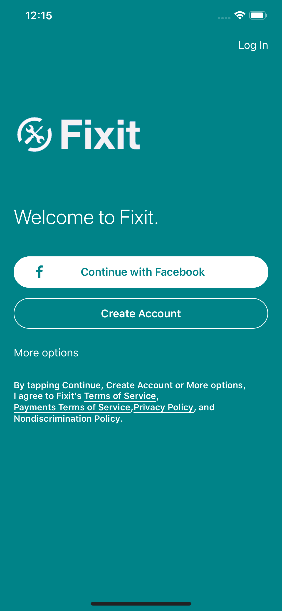
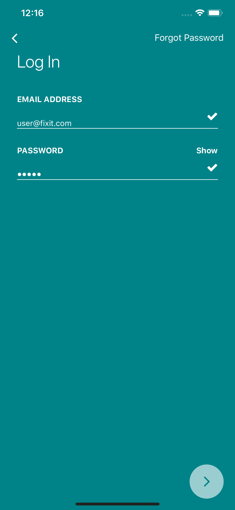
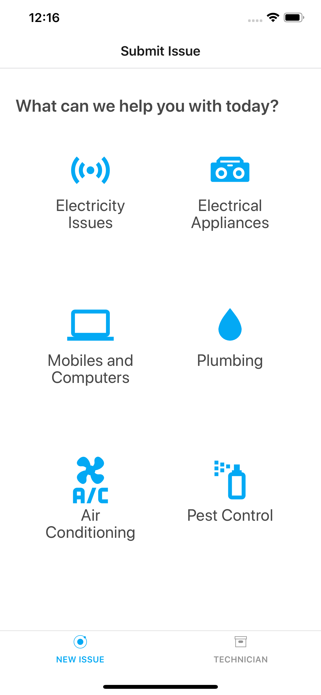
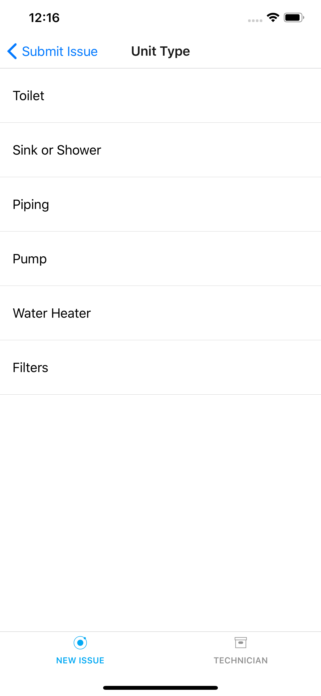
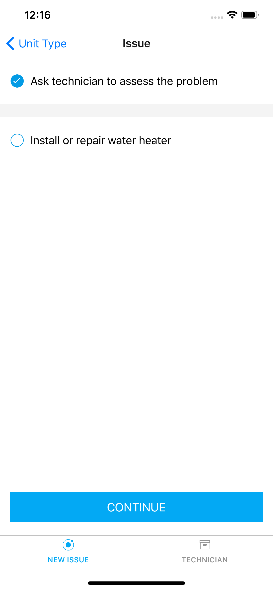
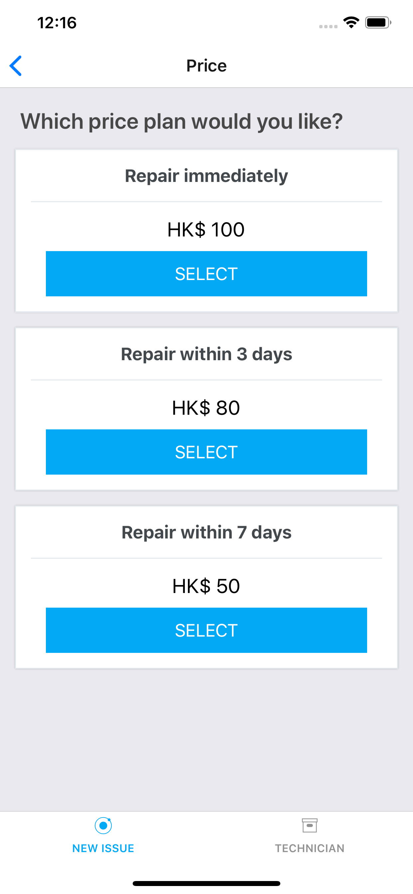
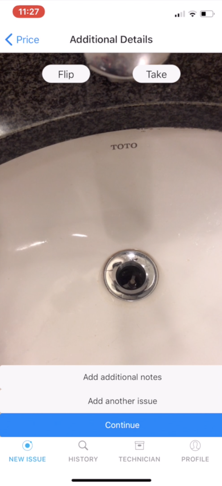
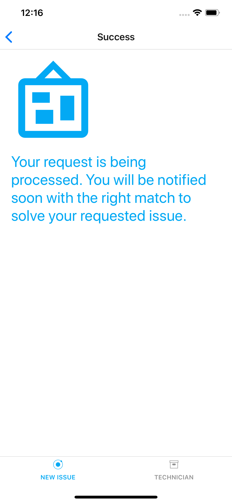
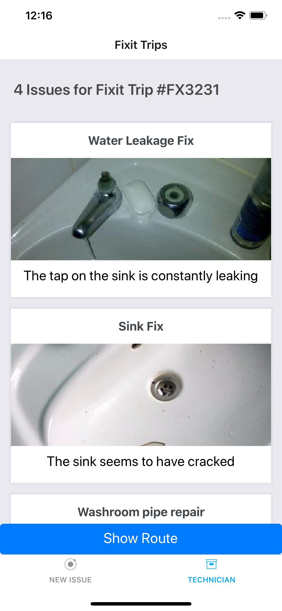
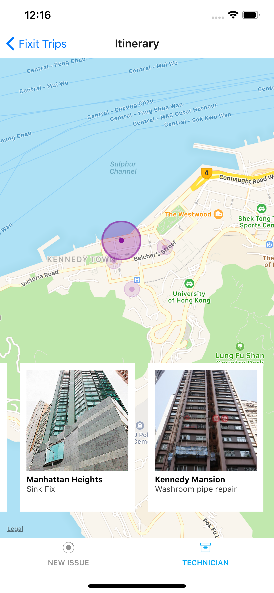

# Fixit

Fixit is a mobile platform which enables access to maintenance services via a new and unique approach by creating a pooled network of services. It aims on achieving a sustainable, and efficient allocation of resources which benefit both the client and technician.

<table>
  <tr>
    <td></td>
    <td></td>
    <td></td>
    <td></td>
  </tr>
  <tr>
    <td></td>
    <td></td>
    <td></td>
    <td></td>
  </tr>
  <tr>
    <td></td>
    <td></td>
  </tr>
</table>

# Team
Fixit was developed at **SmarTone Hackathon 2018** over a course of 24 hours from **20 to 21 October, 2018** by the following team:
1. [Chhavi Sharma](https://www.linkedin.com/in/chhavi151999/)
2. [Nitya Pendkar](https://www.linkedin.com/in/nitya-pendkar-802705171/)
3. [Piyush Jha](https://www.linkedin.com/in/piyush-jha/)
4. [Justin Das](https://www.linkedin.com/in/justin-jay-das-036a5512b/)
5. [Waqas Ali](https://waqasaliabbasi.com/)

# How to run App
## Backend
Node.js backend and Machine Learning model have been developed to show we can. However they have not been integrated with the mobile app because of lack of time during the hackathon.

## Frontend
- Clone
- `cd App`
- Run `yarn install`
- Run `expo start`
- Use Expo client on iOS/Android or Simulator to use app

### Login details
- email: user@fixit.com
- password: 12345

# Business Details

Often, users get frustrated when they need maintenance services to cater to an appliance which needs repair or when a new device is to be installed. This can be both an expensive and inefficient service to locate. In addition to that, it is common that multiple clients in the same or nearby locality require a similar maintenance service. Our platform has tie-ups with licensed and reliable maintenance service companies which can cater not to just one problem at a time, but multiple!

The cost for the client may be reduced as when residents in a locality request for a similar service. Fixit optimizes travel, causes lesser hassle and save both time and money for the technician. Not just that, but Fixit also gives you an estimate of cost prior to the delivery service.

Our user friendly one-stop destination for all essential maintenance needs offers services ranging from Installation & Repair of electrical appliances, to plumbing to Relocation & logistics.
